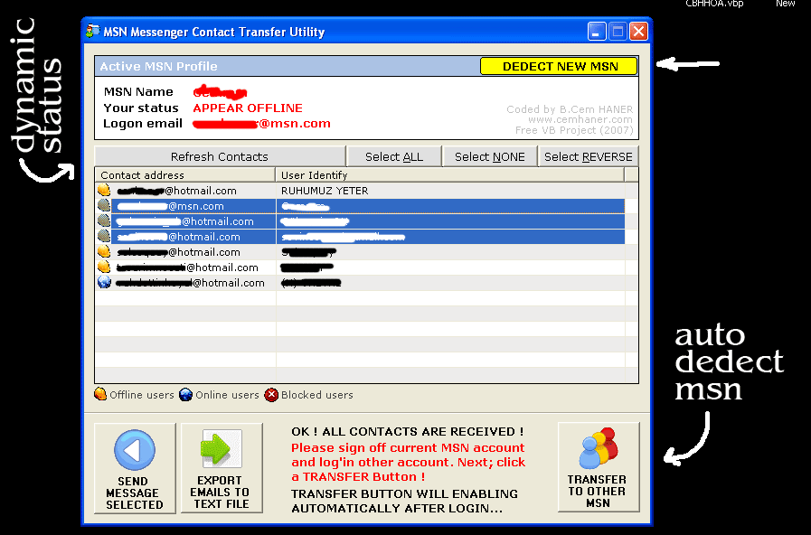



## Excellent MSN Messenger Contact Transfer Utility / Email Exporter

### Description

MSN Messenger Contact Transfer Utility.

Excellent condition, Professional skin.

Yo can transfer all or selected msn accounts other msn address or export account emails TXT file.

Use:

1. Login Messenger account.

2. Start program. (Software will receive all contacts)

3. Sign off Messenger

4. Login other Messenger account

5. Software will auto-dedect new msn account.

6. Push transfer button !

Finish!

All contacts transferred other Messenger !

or

You can export MSN Contacts TEXT file. And import your other programs quickliy!

Thanks for votes!
 
### More Info
 

             |
---                |---
**Submitted On**   |2007-01-19 06:00:36
**By**             |[B\.Cem HANER](https://github.com/Planet-Source-Code/PSCIndex/blob/master/ByAuthor/b-cem-haner.md)
**Level**          |Intermediate
**User Rating**    |5.0 (10 globes from 2 users)
**Compatibility**  |VB 5\.0, VB 6\.0
**Category**       |[Complete Applications](https://github.com/Planet-Source-Code/PSCIndex/blob/master/ByCategory/complete-applications__1-27.md)
**World**          |[Visual Basic](https://github.com/Planet-Source-Code/PSCIndex/blob/master/ByWorld/visual-basic.md)
**Archive File**   |[Excellent\_2043341192007\.zip](https://github.com/Planet-Source-Code/b-cem-haner-excellent-msn-messenger-contact-transfer-utility-email-exporter__1-67670/archive/master.zip)

